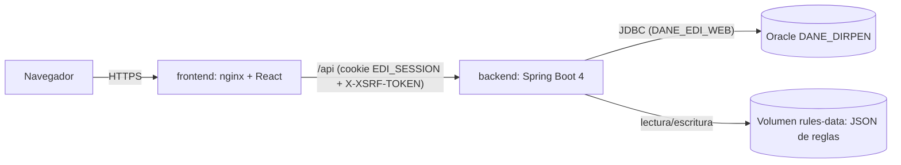

# Arquitectura — Formulario Web EDI/EDID

```mermaid
flowchart LR
  navegador[Navegador] -- HTTPS --> nginx[frontend: nginx + React]
  nginx -- "/api (cookie EDI_SESSION + X-XSRF-TOKEN)" --> api[backend: Spring Boot 4]
  api -- "JDBC (DANE_EDI_WEB)" --> oracle[(Oracle DANE_DIRPEN)]
  api -- "lectura/escritura" --> reglas[(Volumen rules-data: JSON de reglas)]
```
