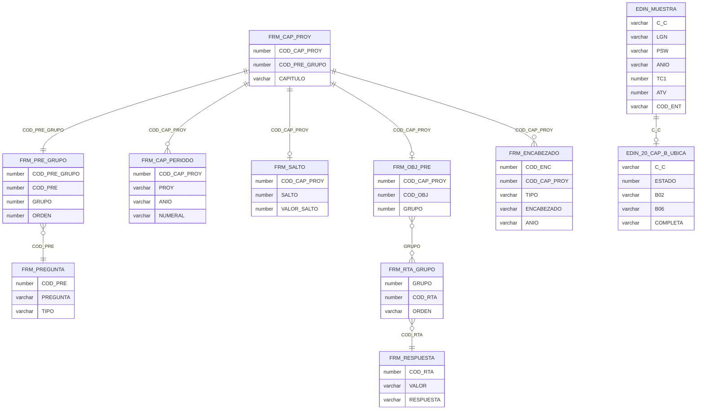

# MER — tablas usadas (Fase 1)

> Esquema deducido del código PHP; pendiente de validar contra el DDL real de DANE_DIRPEN.

```mermaid
erDiagram
  FRM_CAP_PROY ||--|| FRM_PRE_GRUPO : "COD_PRE_GRUPO"
  FRM_PRE_GRUPO }o--|| FRM_PREGUNTA : "COD_PRE"
  FRM_CAP_PROY ||--o{ FRM_CAP_PERIODO : "COD_CAP_PROY"
  FRM_CAP_PROY ||--o| FRM_SALTO : "COD_CAP_PROY"
  FRM_CAP_PROY ||--o| FRM_OBJ_PRE : "COD_CAP_PROY"
  FRM_CAP_PROY ||--o{ FRM_ENCABEZADO : "COD_CAP_PROY"
  FRM_OBJ_PRE }o--o{ FRM_RTA_GRUPO : "GRUPO"
  FRM_RTA_GRUPO }o--|| FRM_RESPUESTA : "COD_RTA"
  EDIN_MUESTRA ||--o| EDIN_20_CAP_B_UBICA : "C_C"
  FRM_CAP_PROY {
    number COD_CAP_PROY
    number COD_PRE_GRUPO
    varchar CAPITULO
  }
  FRM_PRE_GRUPO {
    number COD_PRE_GRUPO
    number COD_PRE
    number GRUPO
    number ORDEN
  }
  FRM_PREGUNTA {
    number COD_PRE
    varchar PREGUNTA
    varchar TIPO
  }
  FRM_CAP_PERIODO {
    number COD_CAP_PROY
    varchar PROY
    varchar ANIO
    varchar NUMERAL
  }
  FRM_SALTO {
    number COD_CAP_PROY
    number SALTO
    number VALOR_SALTO
  }
  FRM_OBJ_PRE {
    number COD_CAP_PROY
    number COD_OBJ
    number GRUPO
  }
  FRM_RTA_GRUPO {
    number GRUPO
    number COD_RTA
    varchar ORDEN
  }
  FRM_RESPUESTA {
    number COD_RTA
    varchar VALOR
    varchar RESPUESTA
  }
  FRM_ENCABEZADO {
    number COD_ENC
    number COD_CAP_PROY
    varchar TIPO
    varchar ENCABEZADO
    varchar ANIO
  }
  EDIN_MUESTRA {
    varchar C_C
    varchar LGN
    varchar PSW
    varchar ANIO
    number TC1
    number ATV
    varchar COD_ENT
  }
  EDIN_20_CAP_B_UBICA {
    varchar C_C
    number ESTADO
    varchar B02
    varchar B06
    varchar COMPLETA
  }
```
