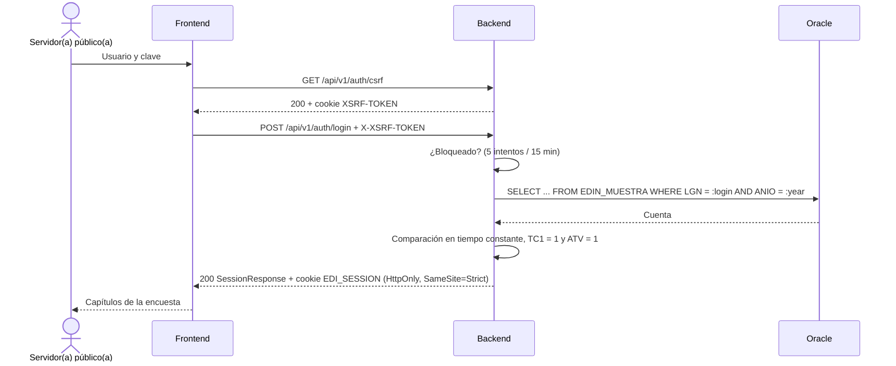

# Secuencia — inicio de sesión

```mermaid
sequenceDiagram
  actor U as Servidor(a) público(a)
  participant F as Frontend
  participant B as Backend
  participant O as Oracle
  U->>F: Usuario y clave
  F->>B: GET /api/v1/auth/csrf
  B-->>F: 200 + cookie XSRF-TOKEN
  F->>B: POST /api/v1/auth/login + X-XSRF-TOKEN
  B->>B: ¿Bloqueado? (5 intentos / 15 min)
  B->>O: SELECT ... FROM EDIN_MUESTRA WHERE LGN = :login AND ANIO = :year
  O-->>B: Cuenta
  B->>B: Comparación en tiempo constante, TC1 = 1 y ATV = 1
  B-->>F: 200 SessionResponse + cookie EDI_SESSION (HttpOnly, SameSite=Strict)
  F-->>U: Capítulos de la encuesta
```
